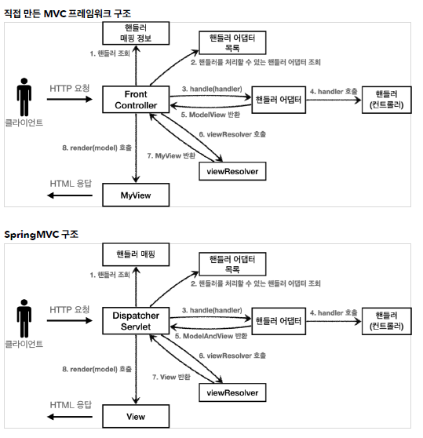

# HttpServlet 학습
- 출처: 인프런 김영한님 강의 '스프링 MVC 1편 - 백엔드 웹 개발 핵심 기술' 
- https://www.inflearn.com/course/%EC%8A%A4%ED%94%84%EB%A7%81-mvc-1/questions?s=index.html&page=1&type=question
- Spring MVC 이전의 자바 웹 백엔드의 기술들을 이해하고 어떻게 진화하면서 Spring MVC가 나오게 되었는지 이해한다.

## 학습 목차

- [웹 어플리케이션과 JSP](#웹-어플리케이션과-)
- [JSP로만 개발](#JSP로만-개발)
- [MVC 패턴](#MVC-패턴)
- [서블릿 구조 개선](#서블릿-구조-개선)
- [Spring MVC](#Spring-MVC)
---

## 웹 어플리케이션과 JSP

### 웹 서버 , 웹 애플리케이션 서버(WAS)

- 공통점
    -HTTP 기반
- 차이점
    - 웹 서버는 웹 브라우저 클라이언트로부터 HTTP 요청을 받아 정적 리소스(.html, .jpeg, .css) 제공한다.
    - WAS는 DB조회나 애플리케이션 코드를 실행하여 동적인 컨텐츠를 제공하기 위해 존재한다.

### 웹 시스템 구성 
 
 
 - 정적 리소스는 웹 서버가 처리하고 애플리케이션 로직 같은 동적 처리는 WAS에게 넘겨준다.
 - 역할을 나눈 덕에 요구 사항에 형태와 양에 따라 서버의 크기를 증설하거나 줄일 수 있다.
 - WAS가 오류로 인해 작동 하지 않으면 웹 서버가 오류 화면을 제공할 수 있다.
 
 ### 서블릿을 지원하는 WAS를 사용해야 하는 이유
 <div align=center>   </div>
 - 개발자는 HTTP 통신에 관련된 개발을 하지 않고, 서비스에 필요한 기능 구현에만 집중할 수 있게 도와준다.
---
## 서블릿으로만 개발
### 정의 
- 클라이언트의 HTTP 요청에 대해 특정 기능을 수행, HTML문서를 생성등의 응답을 하는 인터넷 서버 프로그램
- 클라이언트 요청을 처리하고 그 결과를 다시 클라이언트에게 전송하는 Servlet 클래스의 구현 규칙을 지킨 자바 프로그램 

### 서블릿 컨테이너
- 서블릿의 객체를 생성, 초기화, 호출, 종료하는 생명주기를 관리한다.
- 서블릿 객체를 싱글톤으로 관리하여 모든 클라이언트의 요청은 동일한 서블렛 객체 인스턴스에 접근하게 하여 효율적으로 관리한다.
- 클라이언트의 Request를 받고 Response를 내보낼수 있도록 웹 서버와 소켓을 만들어 통신을 가능케 한다.
- 동시 요청을 위한 멀티 쓰레드 지원
    
  

### 멀티 쓰레드 처리 방식
- WAS가 쓰레드 풀을 생성하고 요청 메시지가 올때마다 연결을 위해 쓰레드를 할당한다.
- 만약 쓰레드 풀에 있는 모든 쓰레드가 사용 중 이라면, 이후의 요청은 대기 시키거나 거절한다.
- 이로 인해 쓰레드를 생성하고 종료하는 비용(CPU)가 절약되고, 응답 시간이 빠르다.
- 쓰레드 풀의 최대 쓰레드 수는 설정할 수 있지만 너무 적게 설정하면 서버 리소스는 여유롭지만 클라이언트 요청에 대한 응답이 지연되고, 
너무 많게 설정하면 CPU 메모리 리소스 임계점을 초과하여 서버가 다운되는 장애가 발생할 수 있다.
- 따라서 실제 서비스와 똑같은 환경에서 테스트 시도하여 최적의 설정 값을 찾아야 한다.


 
    
### HttpServletRequest, HttpServletResponse
- HttpServletRequest
    - 서블릿이 HTTP 요청 메시지를 파싱하여 **HttpServletRequest**라는 객체에 담는다. 개발자가 애플리케이션 코드로써 쉽게 조회할 수 있도록 돕는다.
    - 자바 서블릿에서는 요청 메시지에 각 필드들에 담긴 정보들을 조회할 수 있는 다양한 메서드를 지원한다.
- HttpServletResponse
    - 요청 메시지를 처리하고 응답 메시지를 담는 객체로 HTTP 응답코드와, header 와 body를 생성할 수 있다.
    - 요청 메시지와 마찬 가지로 헤더에 각 필드마다 정보를 삽입할 수 있는 다양한 메서드를 지원한다.

### 응답이 HTML일때
```
 @Override
    protected void service(HttpServletRequest request, HttpServletResponse response) throws ServletException, IOException {

        response.setContentType("text/html");
        response.setCharacterEncoding("utf-8");

        PrintWriter writer = response.getWriter();
        writer.println("<html>");
        writer.println("<body>");
        writer.println("  <div>안녕?</div>");
        writer.println("</body>");
        writer.println("</html>");
    }
```
- 응답 메시지에 HTML 코드들을 한줄씩 담아서 보내주어야 한다.
### 템플릿 엔진의 필요성
- 서블릿 덕분에 동적으로 원하는 HTML을 마음껏 만들수 있지만, 코드가 매우 비효율 적이다. 이것이 바로 템플릿 엔진이 나온 이유이다. 
템플릿 엔진을 사용하면 HTML 문서에서 필요한 곳만 코드를 적용해서 동적으로 변경할 수 있다.
---
## JSP로만 개발
### 회원 관리 예제에서 모든 회원을 조회하는 jsp 코드
```
<%@ page contentType="text/html;charset=UTF-8" language="java" %>
<%@ page import="hello.servlet.domain.member.Member" %>
<%@ page import="java.util.List" %>
<%@ page import="hello.servlet.domain.member.MemberRepository" %>
<%
    MemberRepository memberRepository = MemberRepository.getInstance();
    List<Member> members = memberRepository.findAll();
%>
<html>
<head>
    <meta charset="UTF-8">
    <title>Title</title>
</head>
<body>
<a href="/index.html">메인</a>
<table>
    <thead>
    <th>id</th>
    <th>username</th>
    <th>age</th>
    </thead>
    <tbody>
    <%
        for (Member member : members) {
            out.write("    <tr>");
            out.write("        <td>" + member.getId() + "</td>");
            out.write("        <td>" + member.getUsername() + "</td>");
            out.write("        <td>" + member.getAge() + "</td>");
            out.write("    </tr>");
        }
    %>
    </tbody>
</table>

</body>
</html>
```
- 이전에 서블릿으로 HTML을 개발할 때보다 화면을 만드는 작업을 분리할 수 있었고 동적으로 생성해야 하는 부분에 대해서만 자바 코드를 적용한 모습이다.
- 그런데 결국 코드의 절반은 비즈니스 로직에 해당하고 나머지가 HTML을 위한 코드로 나뉘어져 있다.
- 프론트와 백엔드의 구분이 없어보이고, 코드를 관리 및 보수를 하는데 있어서 어려움이 있어 보인다.
- 그래서 비즈니스 로직은 서블릿처럼 독립된 곳에서 처리하고, JSP는 HTML View를 생성하는 작업에 집중할 수 있도록 도와주는 MVC 패턴이 등장하게 된다.
---
## MVC 패턴

   

### M: Model
- 뷰에 출력할 데이터를 담아둔다. 뷰가 필요한 데이터를 모두 모델에 담아서 전달해주는 덕분에 뷰는 비즈니스 로직이나, 데이터의 접근에 대해 몰라도 된다.

### V: View
- 모델에 담겨있는 데이터를 사용해서 화면을 그리는 일에 집중한다. 여기서는 HTML을 생성하는 부분을 말한다.

### C: Controller
- HTTP 요청을 받아서 파라미터를 검증하고, 비즈니스 로직을 실행한다. 그리고 뷰에 전달할 결과 데이터를 조회해서 모델에 담는다.

### 기존 Servlet에 MVC패턴 적용후 문제점
- HTML을 그리는 뷰와 컨트롤러를 확실히 구분이 되었지만, 아직도 컨트롤러에서는 중복되는 코드가 많다.
    - View를 이동시키기 위한 코드가 계속 중복된다.
    ```
    RequestDispatcher dispatcher = request.getRequestDispatcher(viewPath);
    dispatcher.forward(request, response);
    ```
    - ViewPath가 절대경로로 들어가 있기 때문에 일부분이 중복된다.
    ```
    String viewPath = "/WEB-INF/views/new-form.jsp";
    /WEB-INF/views ->이 부분
    ```
- 컨트롤러의 HTTP 메세지를 담은 객체 HttpServletRequest, HttpServletResponse 들을 사용하지 않는 경우도 있다.
- 기능이 많아지고 복잡해지면, 컨트롤러에서 공통적으로 처리해야 하는 부분이 더 많이 증가하게 된다. 이를 메서드로 뽑아도, 결과적으로 항상 그 메서드를 
호출해야 하고, 실수로 호출하지 않으면 문제가 된다.


### 해결법
- 공통기능을 처리할 수 있는 **프론트 컨트롤러**를 생성한다.
- 프론트 컨트롤러 도입 전

    

- 프론트 컨트롤러 도입 후
 
    
    
    - 프론트 컨트롤러 하나로 클라이언트의 요청을 받고 다른 컨트롤러들의 공통 로직을 처리하고, 세부 로직을 실행하기 위해 해당 컨트롤러에게 책임을 위임한다.
    
---
## 서블릿 구조 개선

### v1

- 구조

    

- 핵심 로직
    -   FrontControllerServletV1.java
        ```
        public FrontControllerServletV1() {
                controllerMap.put("/front-controller/v1/members/new-form", new MemberFormControllerV1());
                controllerMap.put("/front-controller/v1/members/save", new MemberSaveControllerV1());
                controllerMap.put("/front-controller/v1/members", new MemberListControllerV1());
            }
        
            @Override
            protected void service(HttpServletRequest request, HttpServletResponse response) throws ServletException, IOException {
                String requestURI = request.getRequestURI();
        
                ControllerV1 controller = controllerMap.get(requestURI);
                if(controller == null){
                    response.setStatus(HttpServletResponse.SC_NOT_FOUND);
                    return;
                }
        
                controller.process(request, response);
            }
        ```
        - controllerMap에 URL을 맵핑시켜 초기화 하고
        - 클라이언트 요청에 따라 결정된 컨트롤러를 생성하고 실행시킨다.
        - 프론트 컨트롤러가 만들어짐으로써, 다른 컨트롤러는 어떤 요청이 왔는지 신경쓰지 않고 해당 비즈니스 로직만 실행하면 된다. 
 
 - 보완점
    - 프론트 컨트롤러를 제외한 모든 컨트롤러에서 뷰를 포워딩하는 중복이 있다.
        - MemberFormControllerV1
        
        ```
        String viewPath = "/WEB-INF/views/new-form.jsp";
        RequestDispatcher dispatcher = request.getRequestDispatcher(viewPath);
        dispatcher.forward(request,response);
        ```
        - MemberSaveControllerV1
    
        ```
        String viewPath = "/WEB-INF/views/save-result.jsp";
        RequestDispatcher dispatcher = request.getRequestDispatcher(viewPath);
        dispatcher.forward(request,response);
        ```
      
        - MemberListControllerV1
        
        ```
        String viewPath = "/WEB-INF/views/members.jsp";
        RequestDispatcher dispatcher = request.getRequestDispatcher(viewPath);
        dispatcher.forward(request,response);
        ```
      
### v2

- 구조

    

- 핵심 로직

    - MyView.java
    
        ```
          public void render(HttpServletRequest request, HttpServletResponseresponse) throws ServletException, IOException {
              RequestDispatcher dispatcher = request.getRequestDispatcher(viewPath);
              dispatcher.forward(request, response);
          }
        ```
      
      - 이동시킬 뷰의 경로를 갖는 클래스를 만들고 포워딩하는 기능을 추가 했다.
      
    - FrontControllerServletV2.java
        ```
         MyView view = controller.process(request, response);
         view.render(request, response);
        ```
        - V1과 같이 URL을 맵핑하여 컨트롤러를 호출 및 실행시켜서 해당 컨트롤러에서는 포워딩 시킬 viewPath를 반환시켜 준다.
        - 그리고 프론트 컨트롤러는 해당 뷰를 렌더링한다.

- 보완점
    - 컨트롤러 입장에서 HttpServletRequest, HttpServletResponse이 필요하지 않을 수 있다.
    - 요청 파라미터를 넘기는 자료구조와 별도로 Model을 만들어서 응답을 보낼 수 있다면, 코드도 단순해지고 테스트하기도 쉽다.
    
 
### v3
 - 구조는 v2와 동일하다
 
 - 핵심 로직
    - ModelView.java
    
        ```
         private String viewName;
         private Map<String, Object> model = new HashMap<>();   
        ```
      - 뷰의 이름과 렌더링할 때 필요한 model 객체를 가지고 있는 Map을 선언하였다. 요청에 필요한 컨트롤러에서 뷰에 필요한 데이터를
      map에 담아 프론트 컨트롤러에게 넘겨주면 된다.
    
    - FrontControllerServletV3.java
    
      ```
      private Map<String, String> createParamMap(HttpServletRequest request) {
              Map<String, String> paramMap = new HashMap<>();
              request.getParameterNames().asIterator()
                      .forEachRemaining(paramName -> paramMap.put(paramName, request.getParameter(paramName)));
              return paramMap;
      }
      ```
        - HttpServletRequest에서 파라미터 정보를 꺼내서 Map으로 변환한다. 그리고 해당 Map(paramMap)을 컨트롤러에 전달하면서 호출한다.
        
        ```
            private MyView viewResolver(String viewName) {
                   return new MyView("/WEB-INF/views/" + viewName + ".jsp");
            }
        ```
        - 컨트롤러가 반환한 논리 뷰 이름을 실제 물리 뷰 경로로 변경한다. 그리고 실제 물리 경로가 있는 MyView 객체를 반환한다.
         ```
          protected void service(...){
              ControllerV3 controller = controllerMap.get(requestURI);
              if(...) // 컨트롤러 존재 예외처리
              Map<String, String> paramMap = createParamMap(request);
              ModelView mv = controller.process(paramMap);
              
              String viewName = mv.getViewName();
              MyView view = viewResolver(viewName);
              
              view.render(mv.getModel(),request,response);
          }
         ```
       - v2의 보완점으로 프론트 컨트롤러에서 paraMap을 보냄으로써 필요한 매개변수를 해당 컨트롤러에서 꺼내서 모델을 만들었고, 중복되는 viewPath를 논리적인 이름으로 간단하게 바꾸었고, viewResolver를 통해서  렌더링할 물리적인 경로를 정해준다.
       - 비즈니스 로직을 실행하는 컨트롤러는 서블릿의 종속성을 제거 했다고 볼 수 있다.
       
- 보완점
    - 컨트톨러 인터페이스를 구현하는 개발자 입장에서 보면, 항상 ModelView 객체를 생성하고 반환해야 하는 부분이 조금은 번거롭다.
    - 좋은 프레임워크는 아키텍처도 중요하지만, 그와 더불어 실제 개발하는 개발자가 단순하고 편리하게 사용할 수 있어야 한다. 소위 실용성이 있어야 한다.
    
### v4
- 구조

    
    
- 핵심 로직
    ```
        protected void service(HttpServletRequest request, HttpServletResponseresponse){
            Map<String, String> paramMap = createParamMap(request);
            Map<String, Object> model = new HashMap<>();
            
            String viewName = controller.process(paramMap, model);
            
            MyView view = viewResolver(viewName);
            
            view.render(model,request,response);
        }
    ```
  - 모델 객체를 프론트 컨트롤러에서 생성해서 넘겨준다. 컨트롤러에서 모델 객체에 값을 담아서 반환한다.
  
- 보완점
    - 만약 다른 버전의 개발자들이 각각 다른 컨트롤러를 사용하고 싶어도 정해진 컨트롤러를 사용해야한다.
    
### v5

- 구조

    
    
- 핵심 로직

    - MyHandlerAdapter.java
        ```
          public interface MyHandlerAdapter {
          
              boolean support (Object handler);
          
              ModelView handle(HttpServletRequest request, HttpServletResponse response, Object handler
              ) throws ServletException, IOException;
          }
        ```
        - support() 
            - handler는 컨트롤러를 의미하고, 어댑터가 해당 컨트롤러를 처리할 수 있는지 판단한다.
        - handle()
            - 어댑터는 실제 컨트롤러를 호출하고, 그 결과로 ModelView를 반환해야 한다.
        
            - 실제 컨트롤러가 ModelView를 반환하지 못하면, 어댑터가 ModelView를 직접 생성해서라도 반환해야 한다.
            - 이전에는 프론트 컨트롤러가 실제 컨트롤러를 호출했지만 이제는 이 어댑터를 통해서 실제 컨트롤러가 호출된다.
     
     - FrontControllerServletV5.java
        ```
           public FrontControllerServletV5() {
               initHandlerMappingMap();
               initHandlerAdapters();
           }
       
           private void initHandlerMappingMap() {
               handlerMappingMap.put("/front-controller/v5/v3/members/new-form", new MemberFormControllerV3());
               handlerMappingMap.put("/front-controller/v5/v3/members/save", new MemberSaveControllerV3());
               handlerMappingMap.put("/front-controller/v5/v3/members", new MemberListControllerV3());
       
               handlerMappingMap.put("/front-controller/v5/v4/members/new-form", new MemberFormControllerV4());
               handlerMappingMap.put("/front-controller/v5/v4/members/save", new MemberSaveControllerV4());
               handlerMappingMap.put("/front-controller/v5/v4/members", new MemberListControllerV4());
           }
       
           private void initHandlerAdapters() {
               handlerAdapters.add(new ControllerV3HandlerAdapter());
               handlerAdapters.add(new ControllerV4HandlerAdapter());
           }
        ```
       - 이전에는 컨트롤러를 직접 매핑해서 사용했다. 그런데 이제는 어댑터를 사용하기 때문에, 
       컨트롤러 뿐만아니라 어댑터가 지원하기만 하면, 어떤 것이라도 URL에 매핑해서 사용할 수 있다. 
       그래서 이름을 컨트롤러에서 더 넒은 범위의 핸들러로 변경했다.]
      
       - 생성자를 통하여 핸들러 맵핑과 어댑터를 등록한다.
       
       ```
       private Object getHandler(HttpServletRequest request) {
            String requestURI = request.getRequestURI();
            return handlerMappingMap.get(requestURI);
       }
       ```
       - 핸들러 맵핑 정보인 handlerMappingMap에서 URL에서 맵핑된 핸들러(컨트롤러) 캑체를 반환한다.
       
       ```
       private MyHandlerAdapter getHandlerAdapter(Object handler) {
               for (MyHandlerAdapter adapter : handlerAdapters) {
                   if (adapter.support(handler)) {
                       return adapter;
                   }
               }
               throw new IllegalArgumentException("handler adapter를 찾을 수 없습니다. handler =" + handler);
       }
       ```
       - handler(컨트롤러)를 처리할 수 있는 어댑터를 찾아서 반환한다.
       - 예를들어, handler가 ControllerV3 인터페이스를 구현했다면, ControllerV3HandlerAdapter 객체가 반환된다.
       
## Spring MVC 
 - 지금까지 v1~v5까지 프레임워크를 점진적으로 구조를 개선했다.
 - 이것은 사실 스프링 MVC와 거의 같은 구조로 작동하고 있다.
 
    
  
    - DispatcherServlet(이전에 구현한 FrontController와 거의 동일)
        
        - HttpServlet 을 상속 받아서 사용하고, 서블릿으로 동작한다.
        
        - 스프링 부트는 DispacherServlet 을 서블릿으로 자동으로 등록하면서 모든 경로( urlPatterns="/" )에 대해서 매핑한다.
        
        - HttpServlet 이 제공하는 serivce() 가 호출된다. 그리고 스프링 MVC는 DispatcherServlet 의 부모인 FrameworkServlet 에서 service() 를 오버라이드
          했고 최종적으로 DispacherServlet.doDispatch().
          
        - doDispatch()에서 위의 그림과 같은 흐름으로 최종적으로 뷰를 렌더링한다.
        
        - 이전에 v5에 구현해 놨던 흐름과 같이 어댑터를 통해 요청에 해당하는 컨트롤러를 호출하고 뷰를 반환하는 로직이 거의 동일하다. 
